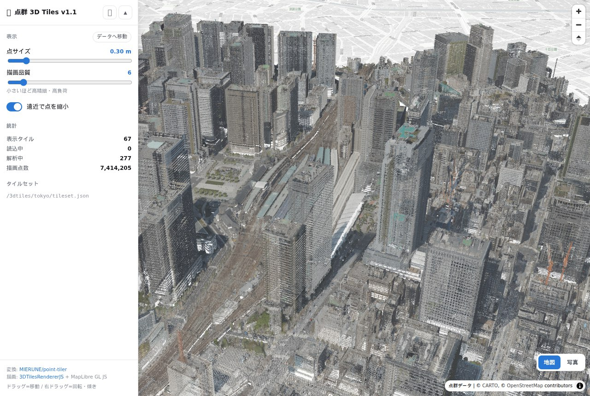

# pointcloud-3dtiles-v1-1-maplibre

LAS/LAZ 点群を [point-tiler](https://github.com/MIERUNE/point-tiler) で **3D Tiles v1.1** に変換し、
**MapLibre GL JS + three.js + [3DTilesRendererJS](https://github.com/NASA-AMMOS/3DTilesRendererJS)** で表示する一式です。

3D Tiles v1.1 では点群タイルの実体が旧来の `.pnts` ではなく **glTF (GLB) の POINTS プリミティブ**になります。
このリポジトリは「変換」と「表示」の両方を、v1.1 ネイティブのまま完結させることを目的にしています。

```
LAS/LAZ ──[ ptiler ]──> 3D Tiles v1.1 (tileset.json + GLB) ──[ 3DTilesRendererJS ]──> MapLibre GL JS
```



## 動作実績

東京都の点群オープンデータ（`09LD18xx` メッシュ 20 ファイル）で確認しています。

| 項目 | 値 |
| --- | --- |
| 入力 | LAS 1.2 / point format 3、20 ファイル、5.8 GB |
| 入力点数 | 118,354,472 点 |
| 入力座標系 | EPSG:6677（JGD2011 平面直角座標系 IX系）|
| 範囲 | 約 1.6 km × 1.5 km（東京駅周辺）、標高 -22.3〜245.4 m |
| 点密度 | 約 39 点/m² |
| 出力 | 3D Tiles v1.1、zoom 15–20、2,701 GLB、1.6 GB |
| 出力点数 | 81,694,113 点（zoom 20。0.2 m ボクセル間引き後）|
| 変換時間 | 148 秒（16 コア / 31 GB RAM）|

## 必要なもの

- **変換**: Linux または macOS（point-tiler は Windows ネイティブ非対応。Windows では WSL または `cargo install` を使う）
- **表示**: Node.js 20 以上

`scripts/inspect-las.py` を使う場合のみ Python と `laspy` が必要です（`pip install laspy`）。

## 使い方

### 1. ptiler を入れる

```bash
./scripts/install-ptiler.sh
export PATH="$HOME/.local/bin:$PATH"
```

### 2. 入力データを置く

`las/<データセット名>/` に LAS/LAZ を置きます。このディレクトリは `.gitignore` 済みです。

```
las/tokyo/09LD1853.las
las/tokyo/09LD1854.las
...
```

変換前にヘッダを確認しておくと事故が減ります。

```bash
python3 scripts/inspect-las.py las/tokyo
```

投影情報 (VLR) を持たないファイルがあると警告が出ます。その場合も `--input-epsg` を明示すれば変換できます
（上記の東京都データも 20 ファイル中 1 ファイルが VLR なしでした）。

### 3. 3D Tiles v1.1 に変換する

```bash
./scripts/convert.sh las/tokyo 3dtiles/tokyo
```

座標系やズーム範囲は環境変数で上書きします。

```bash
INPUT_EPSG=6677 OUTPUT_EPSG=4979 MIN_ZOOM=15 MAX_ZOOM=20 \
  ./scripts/convert.sh las/tokyo 3dtiles/tokyo
```

| 変数 | 既定値 | 説明 |
| --- | --- | --- |
| `INPUT_EPSG` | `6677` | 入力座標系。平面直角座標系 IX系（東京周辺）|
| `OUTPUT_EPSG` | `4979` | 出力座標系。3D Tiles では WGS84 3D を使う |
| `MIN_ZOOM` | `15` | 最小ズーム |
| `MAX_ZOOM` | `20` | 最大ズーム |
| `THREADS` | `nproc` | 並列数 |
| `MAX_MEMORY` | `16384` | メモリ上限 (MB) |

**最大ズームの決め方**が出力品質を大きく左右します。point-tiler は
`geometric error × 0.1` のボクセルグリッドで 1 点だけを残すよう間引くためです。

| zoom | geometric error | ボクセル | 上限密度 |
| --- | --- | --- | --- |
| 18（point-tiler 既定） | 8.0 | 0.8 m | 約 1.6 点/m² |
| 19 | 4.0 | 0.4 m | 約 6 点/m² |
| 20 | 2.0 | 0.2 m | 約 25 点/m² |
| 21 | 1.0 | 0.1 m | 約 100 点/m² |

元データが 39 点/m² だったため、既定の 18 では間引きが強すぎます。本リポジトリでは **20** を既定にしています。
入力密度に対して最大ズームを上げすぎても出力点数は増えないので、`inspect-las.py` が出す点密度を目安にしてください。

### 4. 表示する

```bash
cd viewer
npm install
npm run dev
```

http://localhost:8080/ を開くと、タイルセットの位置へ自動で移動します。
開発サーバーはリポジトリ直下の `3dtiles/` を `/3dtiles` として配信するので、成果物の複製は不要です。

| 機能 | 説明 |
| --- | --- |
| 点サイズ | 点の直径（メートル）。全タイル共有マテリアルなので即座に反映される |
| 描画品質 | `TilesRenderer.errorTarget`。小さいほど高精細・高負荷 |
| 遠近で点を縮小 | `sizeAttenuation` の切り替え |
| 背景地図 | 右下で「地図」（CARTO、テーマ連動）と「写真」（地理院シームレス写真）を切り替え |
| テーマ | ライト / ダーク。`prefers-color-scheme` を初期値にし、選択は保存される |
| URL hash | 視点が `#ズーム/緯度/経度/方位/傾き` に反映される。hash 付きで開くとその視点を維持する |

設定は URL と環境変数で差し替えられます。

| 指定 | 既定値 | 説明 |
| --- | --- | --- |
| `?tileset=` / `VITE_TILESET_URL` | `/3dtiles/tokyo/tileset.json` | 表示するタイルセット |
| `VITE_DATA_ATTRIBUTION` | `点群データ` | 出典表記 |
| `?debug` | – | `window.__viewer` に `map` と点群レイヤーを露出する |

## ディレクトリ構成

```
.
├── scripts/
│   ├── install-ptiler.sh   point-tiler バイナリの導入
│   ├── convert.sh          LAS/LAZ -> 3D Tiles v1.1
│   └── inspect-las.py      変換前のヘッダ・点密度確認
├── viewer/                 Vite + TypeScript（ビルド不要の dev サーバー付き）
│   ├── index.html
│   ├── vite.config.ts      ../3dtiles を /3dtiles として配信する dev ミドルウェア
│   └── src/
│       ├── main.ts         UI 配線・テーマ・背景地図切替
│       ├── pointcloud.ts   MapLibre カスタムレイヤー + TilesRenderer + 座標変換
│       ├── basemap.ts      背景地図スタイル
│       ├── theme.ts        テーマの保存と適用
│       └── style.css
├── docs/                   スクリーンショット
├── las/                    入力データ（.gitignore 済み）
├── 3dtiles/                変換成果物（.gitignore 済み）
└── logs/                   変換ログ（.gitignore 済み）
```

データと成果物はサイズが大きいためリポジトリには含めていません。

## 実装メモ

### 変換側

`--quantize`（`KHR_mesh_quantization`）のみ有効にしています。POSITION を float32 から
uint16 の正規化整数へ落とすもので、**three.js の GLTFLoader が標準対応**しているため
ビューア側に追加設定が要りません。
`--meshopt`（`EXT_meshopt_compression`）と `--gzip-compress` はさらに小さくなりますが、
前者は `MeshoptDecoder` の登録、後者はサーバ側の `Content-Encoding` 設定が必要になるため既定では使っていません。

### 表示側

MapLibre のカスタムレイヤー（`renderingMode: '3d'`）の中で three.js の `WebGLRenderer` を
MapLibre のキャンバス・WebGL コンテキストに相乗りさせています。実装の骨格は
[MapLibre 公式サンプル](https://maplibre.org/maplibre-gl-js/docs/examples/add-3d-tiles-using-threejs/) に準拠しています。
カメラは 2 つ使い、描画用カメラには MapLibre の投影行列にローカル変換を合成したものを、
`TilesRenderer` の LOD 判定用カメラには投影行列から逆算したビュー行列を渡します。

つまずきやすい点を 3 つ記録しておきます。

**1. ENU 姿勢をルートタイルの `transform` から取ってはいけない**

公式サンプルはシーンの 3 軸（East / Up / -North）をルートタイルの `transform`
（列が East/North/Up の ENU → ECEF 行列）から取り出します。しかし point-tiler の
`tileset.json` はルートに `transform` を持ちません。単位行列で代用すると
**ECEF の Z 軸を「上」とみなす**ことになり、赤道・本初子午線から離れるほど点群が傾きます。
東京（北緯 35.68 度）では `arccos(sin 35.68°) = 54.3 度` ずれました。
本実装では `transform` に頼らず、タイルセット中心の緯度経度から ENU 基底を直接組んでいます
（`ecefToSceneRotation()`）。

**2. 点が 1px でしか描画されない**

point-tiler の GLB は `material` を持たない POINTS プリミティブです。three.js の GLTFLoader は
この場合 glTF 仕様に従って `sizeAttenuation: false` の `PointsMaterial`（＝常に 1px）を割り当てます。
`load-model` イベントで全 `Points` のマテリアルを、`sizeAttenuation: true` と
`vertexColors: true` を持つ共有マテリアルへ差し替えています。共有しているので
UI のスライダーが読み込み済みの全タイルへ即座に効きます。

**3. `hash: true` は Map 生成時に URL を書き換える**

「hash が無ければデータ位置へ自動移動する」という判定は、必ず `new maplibregl.Map()` より
**前**に `location.hash` を読む必要があります。後で読むと MapLibre が書き込んだ hash を
利用者の指定と誤認して自動移動しなくなります。

### バージョン

- `maplibre-gl` 5.24.0（v6 は破壊的変更があり、default export も廃止されている）
- `three` 0.183.0 / `3d-tiles-renderer` 0.4.21（MapLibre 公式サンプルで検証済みの組み合わせ）

### WSL2 + Windows ドライブでの開発

リポジトリを `/mnt/c` 以下に置くと inotify が発火せず、Vite がファイル変更を検知できません
（HMR が効かないうえ、変換結果のキャッシュも更新されないまま古いコードが配信されます）。
`vite.config.ts` で `server.watch.usePolling` を既定 ON にしています。
不要な環境では `VITE_NO_POLL=1 npm run dev` で無効化してください。

## 既知の制限

- **点群の属性は XYZ と RGB のみ**です。point-tiler は GLB 生成時に intensity、
  return number、classification、scan angle、point source ID、GPS time を落とします
  （[README 記載の仕様](https://github.com/MIERUNE/point-tiler)）。
  分類や強度で色分けしたい場合は、py3dtiles で 3D Tiles 1.0 を作ってから
  [3d-tiles-tools](https://github.com/CesiumGS/3d-tiles-tools) の `upgrade --targetVersion 1.1` で
  変換する経路を検討してください。
- point-tiler は Windows ネイティブのリリースバイナリを配布していません（`cargo` からのビルドは可能）。
- 背景地図の「写真」は地理院タイルのため日本国内のみです。

## ライセンス

（未定：公開前に決めてください）

## 参考

- [MIERUNE/point-tiler](https://github.com/MIERUNE/point-tiler)
- [NASA-AMMOS/3DTilesRendererJS](https://github.com/NASA-AMMOS/3DTilesRendererJS)
- [MapLibre GL JS — Add 3D tiles using three.js](https://maplibre.org/maplibre-gl-js/docs/examples/add-3d-tiles-using-threejs/)
- [3D Tiles Specification (Cesium GS)](https://github.com/CesiumGS/3d-tiles)
